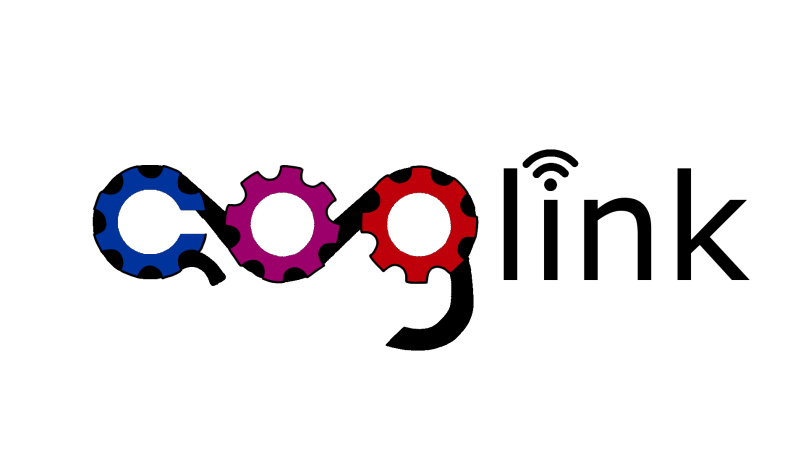

# Coglink

[](https://discord.gg/YcaK3puy49) [](https://www.codacy.com/gh/ThePedroo/Coglink/dashboard?utm_source=github.com&amp;utm_medium=referral&amp;utm_content=ThePedroo/Coglink&amp;utm_campaign=Badge_Grade)



Coglink, the C Lavalink client, with the most performance above all Lavalink wrappers.

## About

Coglink is a C99 Lavalink wrapper/client, which has full coverage of Lavalink API, allowing easy, but still low-level control of Lavalink.

Made with performance, security and stability in mind, so you can run anywhere you want to, with an incredible minimum of 10MB usage of RAM, allowing it to run in really low-end devices with no issues.

## Why?

Using Coglink is an awesome option, it's portable, light-weight and blazing fast (:rocket:). You can easily execute any Lavalink feature, without big codes, but still with a good code.

Portability is one of the best characteristics of Coglink, if your protogen has enough RAM to run it, it will run! You will only require few libraries, which most of them are already installed in most systems.

C Lavalink client? Stability? Yep, no joke! Stability is something we are not worrying about, Coglink is well-developed, and with one of its first missings to be stable, if you report a bug, it will be fixed fastly.

Coglink was made with few libraries, but all of them are secure and stable, you shouldn't be worrying about this, worry about writing good code, because security is something already found here.

## Stability

This branch is considered **stable**, and all functions are working properly and have been tested, what so ever Lavalink v4 is still not complete, breaking changes on Lavalink may come, but will rapidly be fixed in newer commits of Coglink, it's safe to be used on production.

*If marked, considered stable, if not, bugs may be found.*

- [x] Search (Highly stable)
- [x] loadType/track/playlist/error parsing (loadType/track highly stable)
- [x] Play (Highly stable)
- [x] Join voice channel (Highly stable)
- [x] All cleanups (Highly stable)
- [x] DecodeTrack(s) & ParseTrack(s)
- [x] Parse track, pause track, stop track, seek track, set volume
- [x] Set filter
- [x] Get Players & parse get Players
- [x] Get/parse Info
- [ ] Get/parse RouterPlanner
- [x] Get/parse Lavalink Stats (Event included)
- [x] Get Lavalink Version
- [x] Connect/disconnect Node (Highly stable)
- [x] Set event (Highly stable)
- [x] Websocket (**Known bugs with close event**)
- [x] IO poller (Highly stable)

## Compiling

Sadly, Coglink isn't avaible on package managers, but you can compile it yourself, it's easy, don't worry, follow the guide below.

Before starting, you will need to install the required libraries for Coglink, this can be done by the package manager of your OS, you will need to install the mentioned libraries below:

```text
make clang git
```

After installing the libraries, you will need to [compile Concord](https://github.com/Cogmasters/concord).

Then, you will need to clone the Coglink's repo, this can be done by git.

```console
$ git clone https://github.com/ThePedroo/Coglink
```

After that, you can simply use make to compile Concord.

```console
# cd Coglink && make && make install
```

The `make` command will first move the header files to `/usr/local/include/coglink`, then it will compile the C files and "group" them into the `libcoglink.a` file, after all of this, `make install` will move `libcoglink.a` to `/usr/local/lib`, so you can use -lcoglink to use Coglink.

## Using

Using Coglink is deadly easy, but before using its functions, you will need to import the header files, see which header files you will use for your bot below.

```c
#include <coglink/lavalink.h> // Websocket related Coglink functions
#include <coglink/definitions.h> // The definitions of defines like COGLINK_SUCCESS
#include <coglink/rest-lavalink.h> // Functions from Coglink that uses Lavalink rest API
#include <coglink/player.h> // The functions related to the music player
#include <coglink/miscellaneous.h> // Other functions, like decode track, get router planner and etc
#include <coglink/plugins.h> // For add plugin support
```

After including it, you can proceed using Coglink functions, and to compile don't forget to include the flag `-lcoglink` so you can use it.

For usage, you can see the `guides/example` folder, with a really good example of Coglink usage.

## Documentation

We have a Doxygen made documentation, you can see it [here](https://performanc.github.io/CoglinDocs/).

Instead of using the website, you can manually built the documentation by using the `make gen_docs` command, but be sure that you have Doxygen installed.

## Coglink plugins

In Coglink, the creation of plugins to it is possible, that is allowed to change some structs members so it can add more features to Coglink, made by the community, to the community, here are some security measures we take to avoid plugins somehow be malicious:

### Plugins are not allowed to change the members of the struct `lavaInfo`/`client`

To avoid the plugins changing the security settings of Coglink, Coglink copies the `lavaInfo` struct instead of passing the pointer of it, making it impossible to change the settings. And this happens with the `client` struct as well, to avoid changing values that might cause problems.

### Concord's client struct has hidden members (OPTIONAL)

To avoid the plugin to have access to the Concord IO poller, websocket or even the bot token, Coglink removes those members in a copy of the `client` struct and then sends it to the plugin, so it won't have access to the private information, but warning, some plugins may need that information, you can easily allow plugins to access a type of `client` struct member by either changing the value of the `lavaInfo->plugins->security->...`, that in this case will be `allowReadIOPoller`, `allowReadBotToken` or `allowReadConcordWebsocket`.

## Setting up a plugin

Plugins can't straight ahead work in Coglink, you need to pass the functions to Coglink from the plugin, so it can execute when some coglink function is executed, see the function below that does this:

```c
#include <coglink/plugins.h>

struct pluginEvents event = {
  .onSearchRequest = &functionToBeExecuted
}

coglink_setPluginEvents(&lavaInfo, &event);
```

Done, now when the function coglink_searchSong is executed, this will be executed first before Coglink runs it.

## Plugin list

None, sadly, but if you made a plugin for Coglink, please send a PR adding in the line below the format: `[Plugin name](Github repo of the Library) by YourGitHubusername`

If you also want to make a plugin for it, but needs either help of more features, please call me on PerformanC's [Discord server](https://discord.gg/uPveNfTuCJ), we'll be really happy to help ya! ^^

## What is the reason for the creation of Coglink?

Coglink was made to retribute to someone all the help he gave to me, and I'm really thankful for his help, which made me able to create this library, without him, I wouldn't be here.

Concord is also a good library, that **I** consider the best Discord library ever made, but it doesn't have really good attention, and neither support for cool things, like Lavalink, that requires "advanced" knowledge of either Lavalink, Concord WebSocket, and libcurl, that we all know some people are not able to do all this work, so here Coglink is, help them make a stable code.

Coglink was inspired in Concord, its stability and performance are something that everyone would dream to have in all Discord wrappers, but most of them don't, and being realistic, none of them have, Coglink is a library with all of this in mind, to be perfect to use with Concord, an unbeatable duo.

And also, because of my country, Brazil, so it can have more recognition of so many good things it comes from here, like Lua, that most of the softwares that were created here, don't have recognition of its importance and time used to create it, and are extremely underrated.

## Support

In case of any issue using it (except bugs, that should be reported on GitHub Issues), you are free to ask on PerformanC's [Discord server](https://discord.gg/uPveNfTuCJ).

## Credits

Even though I am the single maintainer of Coglink, many people contributed to it, thanks [Cogmaster](https://discord.gg/YcaK3puy49)'s guild members for this. And special thanks to `müller#1001`, without you, I wouldn't be here. :)

Some people that helped on Coglink related things:
  * müller
  * HackerSmacker
  * Goo

Thank you all for the help! ^^

## Dependencies

* `libcurl` >= 7.56.1
* `Concord (master/dev)` 2.2.0
* `jsmn-find` latest (included on Concord 2.2.0)
* `jsmn` latest (included on Concord 2.2.0)
* `tablec` v2.0.0 (built-in into Coglink)

*Tested on:* Ubuntu 22.04.1 x64, Arch Linux x64, Termux Aarch64 (Android 12), Termux armv7 (Android 9), Void Linux latest x64, FreeBSD 13.1 x64, Alpine Linux v3.17 x64